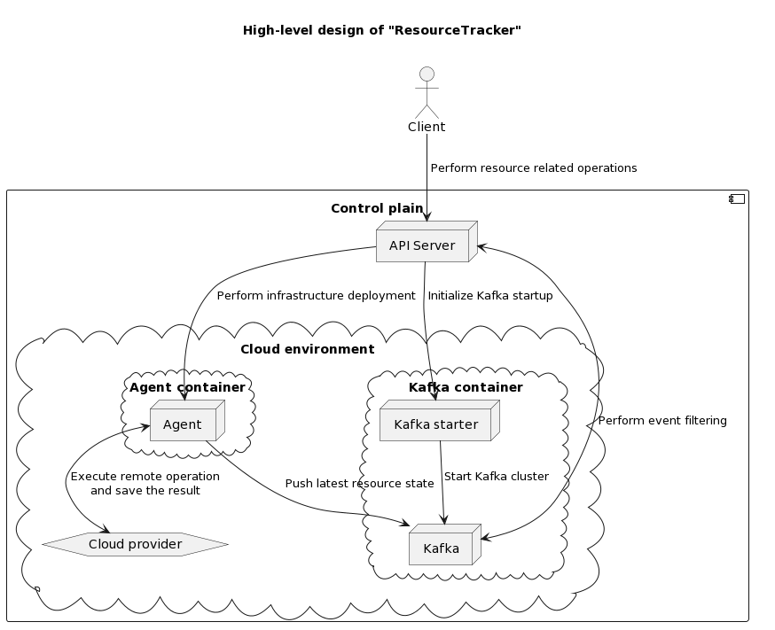
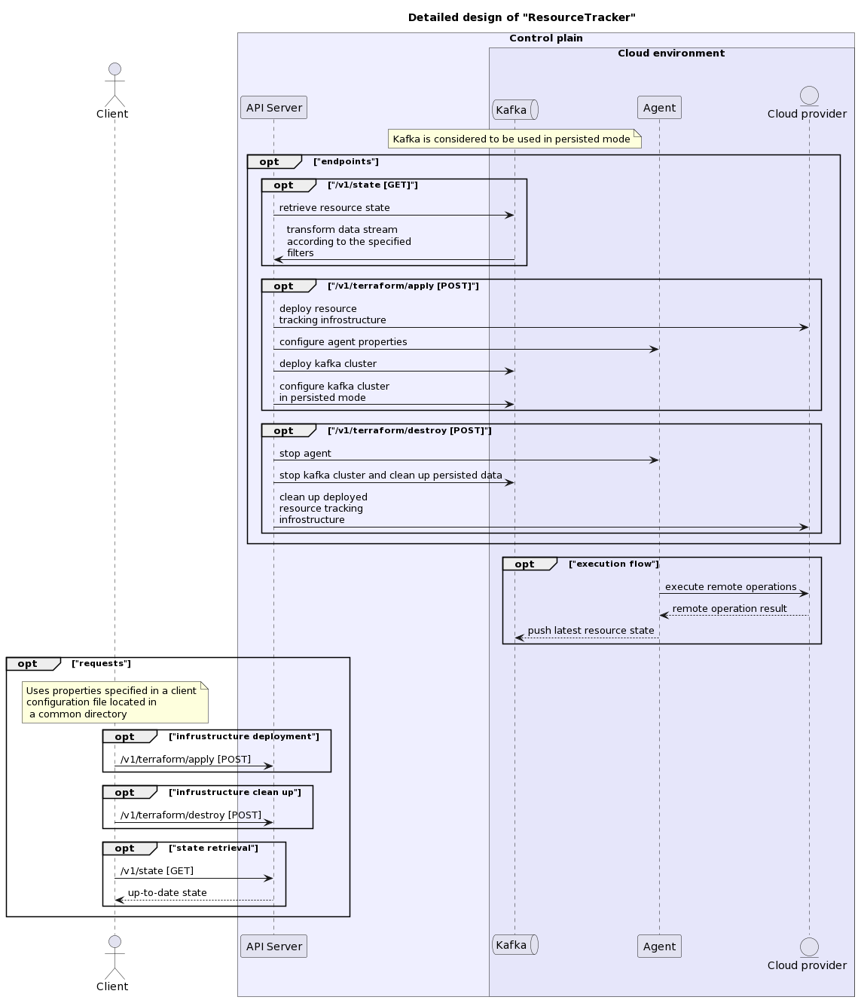

# ResourceTracker

[](https://github.com/YarikRevich/ResourceTracker/actions/workflows/build.yml)


[](https://github.com/vshymanskyy/StandWithUkraine/blob/main/docs/README.md)

## General Information

A cloud-native tool resource state tracking.





ResourceTracker uses server-side data validation. It means, that on client side no data transformation or further analysis are made.
Only API Server calls are on client side responsibility. 

## Setup

All setup related operations are processed via **Makefile** placed in the root directory.

### CLI

In order to build CLI it's required to execute the following command. Initially it cleans the environment and builds Java project using **Maven**
```shell
make build-cli
```

After the execution of command given above the executable will be generated and placed into **bin** folder in the root directory of the project

**CLI** build automatically places default **user.yaml** configuration file into ~/.resourcetracker/config directory.

### GUI

In order to build GUI it's required to execute the following command. Initially it cleans the environment and build Java project using **Maven**
```shell
make build-gui
```

After the execution of command given above the executable will be generated and placed into **bin** folder in the root directory of the project

**GUI** build automatically compiles **API Server** and places both executable JAR and other dependencies into **~/.resourcetracker/bin/api-server** directory

It's highly recommended not to move **API Server** files from the default local directory

### API Server

In order to build **API Server** it's required to execute the following command. Initially it cleans the environment and build Java project using **Maven**
```shell
make build-api-server
```

After the execution of command given above the executable will be generated and placed into **bin** folder in the root directory of the project

## Use cases

For both **CLI** and **GUI** examples, there was used the following user configuration file:
```yaml
requests:
    - name: "first"
      frequency: "10 * * * * *"
      file: "/Volumes/Files/first.sh"
cloud:
    provider: "aws"
    credentials:
      file: "/Volumes/Files/aws.csv"
      region: "us-west-2"
api-server:
    host: "http://localhost:8080"
```

And the following request script file:
```shell
#!/bin/bash

echo "Hello world!"
```

### CLI


### GUI

