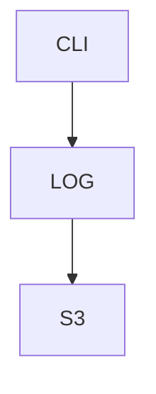

# ResourceTracker

Trackes state of API's. In order to work with ResourceTracker, you should fill some settings into the YAML config file, which should be located in such path as

- /usr/local/etc/resourcetracker.yaml (for Unix-like OS`es)

- TODO: put windows path (for Windows)

# Example of YAML config file

```
local:
	raw_addresses: ["192.168.0.120:9999", ...] 
	//or
	raw_addresses: {
		"some_tag_1": "192.168.0.120:9999",
		...
	}
cloud:
	provider: "aws"
	credentials:
		file: "/usr/local/etc/aws_creds.yaml"
		//or
		access_key: "..."
		secret_key: "..."
	raw_addresses: ["172.0.0.1:9999", ...]
	//or
	raw_addresses: {	
		"some_tag_1": "172.0.0.1:9999",
		...
	}
```

To get more information about syntax of YAML config files, you can look at Wiki

