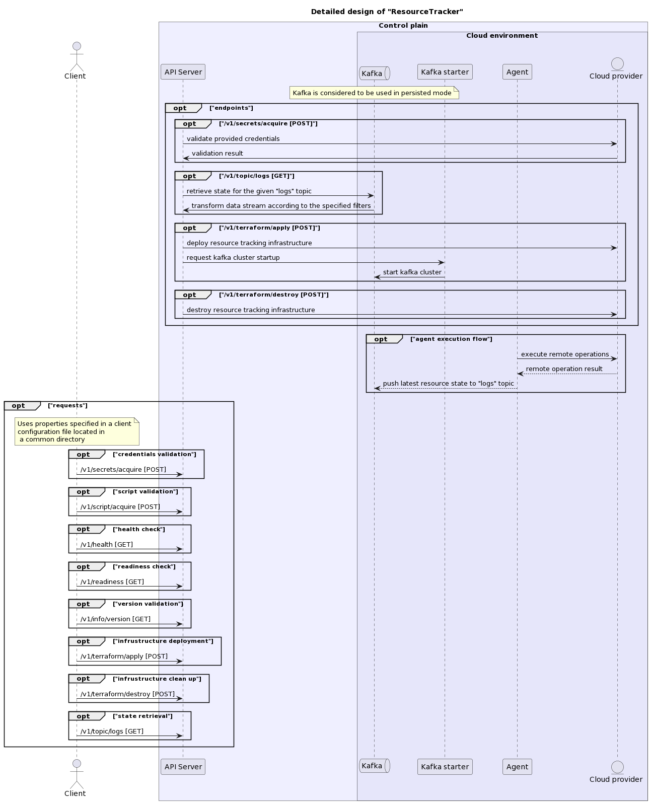

# ResourceTracker

[](https://github.com/YarikRevich/ResourceTracker/actions/workflows/build.yml)


[](https://github.com/vshymanskyy/StandWithUkraine/blob/main/docs/README.md)

## General Information

A cloud-native tool resource state tracking.




## Setup

### CLI

All setup related operations are processed via **Makefile** placed in the root directory.

In order to build the project it's required to execute the following command. Initially it cleans the environment and build Java project using **Maven**
```shell
make build
```

After the execution of command given above all the executables will be generated and placed into **bin** folder in the root directory of the project

### GUI